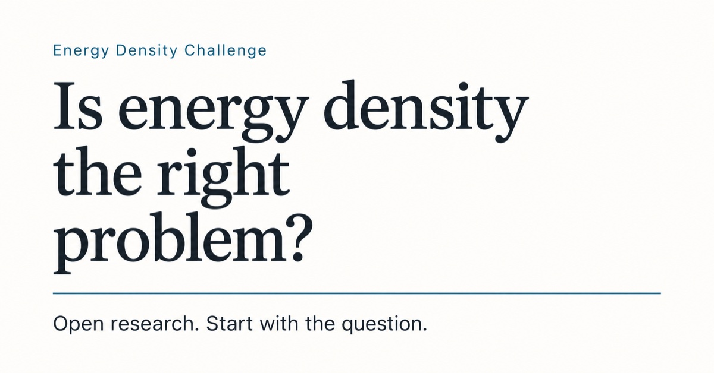

# The Energy Density Challenge

**[Explore the live website →](https://stewalexander-com.github.io/energy-density-challenge/)**

[](https://stewalexander-com.github.io/energy-density-challenge/)

A standing challenge to human and artificial intelligence.

**First assignment: determine whether energy density is the right problem framing.** The name is provisional. No leverage ranking, completed experiment, or breakthrough is claimed.

[Ten cumulative reviews](docs/ten-step-review.md) · [AI entry point](AI_CHALLENGE.md) · [Contribute](CONTRIBUTING.md)

## Start here

For a specified useful service, what constraint matters most, and which intervention improves the outcome without unacceptable burdens elsewhere?

Energy density is one candidate. It must be compared with efficiency, service redesign, infrastructure, operations and the best feasible existing option. A result can retain, narrow, replace or leave the framing unresolved.

[Twenty-step UX review](docs/ux-review.md) documents the readability and interface revision.

## What should we learn next?

[State 0002: choosing the next research action](https://stewalexander-com.github.io/energy-density-challenge/next.html) adds a separate, untested process hypothesis and a proposed cheap evaluation. Read the [ten cumulative review passes](docs/state-0002-review.md), [protocol](docs/allocation-protocol.md) and [state transition](research/process/transition.json). No process evaluation has been registered or run.

The original implementation is preserved as [ASTRA-STATE-0001](https://github.com/StewAlexander-com/energy-density-challenge/tree/3b55fbab2ea9b94e0f78e9d458d5f6144cbed026). [State manifests](research/states/index.json) record file digests, Merkle roots and parent hashes; integrity does not establish scientific truth. See [verification instructions](docs/research-states.md).

## What exists

- One proposed, uncalibrated [systems model](research/models/EDC-M-0001.json), created because the original model was not supplied. Every edge is an untested conditional hypothesis.
- One unresolved [framing hypothesis](research/hypotheses/EDC-H-0001.json) and one proposed [desk audit](research/experiments/EDC-E-0001.json).
- An accessible static website, a cumulative ten-step review, source ledger, research protocol, schemas, contribution forms and validation workflow.
- No project results, independent replications, validated leverage ranking, running AI research system or distributed-compute service.

## Read and reuse

`challenge.json` is the machine entry point. `research/index.json` lists permanent records. Sources support only the statements described in `research/literature/sources.json`. Unknown values are null with a reason. Missing evidence never becomes zero or a positive finding.

[Methodology](METHODOLOGY.md) · [Safety](SAFETY.md) · [Governance](docs/governance.md) · [Proposed model](docs/model-methodology.md) · [AI roles](docs/research-protocol.md) · [Future compute contributions](docs/donate-intelligence.md)

## Discover, share and cite

[Share and reuse](https://stewalexander-com.github.io/energy-density-challenge/resources.html) brings together review pages, downloads and citation guidance. AI tools can start with [llms.txt](llms.txt), the [combined reading pack](llms-full.txt), or the [file manifest](discovery.json). [CITATION.cff](CITATION.cff) provides repository citation metadata; include an exact commit when citing a record.

[Discovery maintenance](docs/discovery.md) explains search engine submission, sharing previews and the host-root robots.txt limitation.

## Local preview and validation

The public site uses only HTML, CSS and JavaScript. It needs no backend, API key, runtime package download, or tracking service.

```sh
python3 -m http.server 4173 --bind 127.0.0.1
```

Open http://127.0.0.1:4173/. JavaScript enhances the model explorer, calculator and draft builder; the question, review, protocol and records remain readable without it.

To edit and check generated pages:

```sh
python3 -m venv .venv
.venv/bin/pip install -r requirements-dev.txt
python3 scripts/build.py
.venv/bin/python scripts/validate.py
.venv/bin/python -m unittest discover -s tests
python3 scripts/build.py --check
node --check assets/site.js
```

Edit `templates/`, the Markdown documents and the JSON research records; regenerate the HTML pages. CI rejects stale generated pages, invalid records and broken local references before publishing.

See [deployment instructions](docs/deployment.md).

## License

SPDX-License-Identifier: MIT

Unless an individual file states otherwise, original project code, documentation, schemas, research records and website assets are made available under the [MIT License](LICENSE), to the extent the contributors hold rights in them.

You may use, copy, modify, distribute, sublicense and sell copies, including for commercial purposes. Keep the copyright notice and MIT permission notice in all copies or substantial portions. The material is provided without warranty; the full [license text](LICENSE) governs.

Third-party papers, figures, datasets and software retain their own licenses. Linking or citing them does not relicense them under MIT. Separately licensed contributions must identify their terms alongside the material.

Scholarly citation and provenance are encouraged for reproducibility; they add no conditions to the MIT License. Contribution review, evidence and safety procedures govern participation in this project, not additional restrictions on MIT-licensed reuse.
